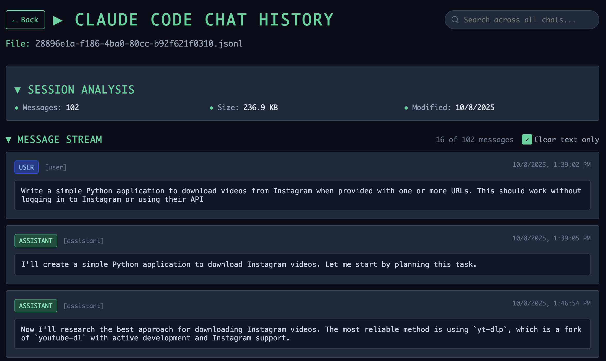

# NOTE!
Don't use this. Simon Willison's [Claude Code Transcripts is better](https://github.com/simonw/claude-code-transcripts)

# Claude Code Chat History Viewer



Browse your Claude Code chat history files.

## Features (can you tell this was an LLM wrote this README?)

- 🌟 **Futuristic Terminal UI** - Dark theme with emerald green accents
- 📁 **Project Navigation** - Browse Claude Code project directories
- 📄 **File Browser** - View JSONL chat session files
- 💬 **Pretty Message Display** - Formatted chat history with syntax highlighting
- 🔍 **JSON Pretty Printing** - Automatically formats JSON content in messages
- ⚡ **Real-time Loading** - Fast file browsing with loading states
- 🎨 **Interactive Design** - Hover effects and smooth transitions

## Quick Start

1. **Clone and setup:**
   ```bash
   git clone <repository-url>
   cd claude-code-chats
   ```

2. **Run the application:**
   ```bash
   ./start.sh
   ```

3. **Access the interface:**
   - Frontend: http://localhost:5173
   - Backend API: http://localhost:8000

## Manual Setup

If you prefer to set up manually:

### Backend (Python FastAPI)
```bash
cd backend
python3 -m venv .venv
source .venv/bin/activate
pip install -r requirements.txt
python main.py
```

### Frontend (React + Vite)
```bash
cd frontend
npm install
npm run dev
```

## How It Works

### Data Source
Claude Code stores chat history locally on macOS in:
```
~/.claude/projects/[project-hash]/[session-id].jsonl
```

### Architecture
- **Backend**: FastAPI server that reads JSONL files and serves them via REST API
- **Frontend**: React application with TypeScript and Tailwind CSS
- **Styling**: Terminal-inspired interface with inline styles for reliability

### API Endpoints
- `GET /projects` - List all Claude Code project directories
- `GET /projects/{project}/files` - List JSONL files in a project
- `GET /projects/{project}/files/{file}` - Read and parse a specific chat file

## Project Structure

```
claude-code-chats/
├── backend/
│   ├── main.py              # FastAPI server
│   ├── requirements.txt     # Python dependencies
│   └── .venv/              # Virtual environment
├── frontend/
│   ├── src/
│   │   ├── App.tsx         # Main React component
│   │   └── index.css       # Global styles
│   ├── package.json        # Node dependencies
│   └── ...                 # Vite configuration
├── start.sh                # Startup script
└── README.md              # This file
```

## Development

### Technologies Used
- **Backend**: Python 3.x, FastAPI, Uvicorn
- **Frontend**: React 18, TypeScript, Vite, Tailwind CSS
- **Styling**: Inline styles with terminal theme

### Key Features Implementation
- **JSON Pretty Printing**: Automatically detects and formats JSON content
- **File Navigation**: Three-level navigation (projects → files → messages)
- **Terminal Aesthetic**: Monospace fonts, emerald accents, dark theme
- **Responsive Design**: Works on desktop and mobile devices

## Customization

### Changing Colors
The color scheme is defined in inline styles within `App.tsx`:
- Primary background: `#0a0e1a`
- Card background: `#1e293b`
- Accent color: `#34d399`
- Text colors: Various slate shades

### Adding Features
The modular React component structure makes it easy to add:
- Search functionality
- Export options
- Different viewing modes
- Message filtering

## Requirements

- **Node.js**: 20.19+ (for Vite compatibility)
- **Python**: 3.8+
- **Claude Code**: Must be installed and have created chat history

## Troubleshooting

### Common Issues

1. **Frontend won't start**: Check Node.js version requirement. Check port conflicts.
2. **No projects found**: Ensure Claude Code has been used and created chat files. Also, this was built for a mac. If you're on a PC, try changing the source folder.
3. **CORS errors**: Backend and frontend must run on specified ports
4. **Styling issues**: All styles are inline, so Tailwind configuration shouldn't affect appearance

### Port Conflicts
If default ports are in use:
- Backend runs on port 8000
- Frontend runs on port 5173 (or 5174 if 5173 is busy)

## License

MIT License - see LICENSE file for details.
---

**Note**: This tool is designed for viewing Claude Code chat history locally. It does not upload or share any data externally.
