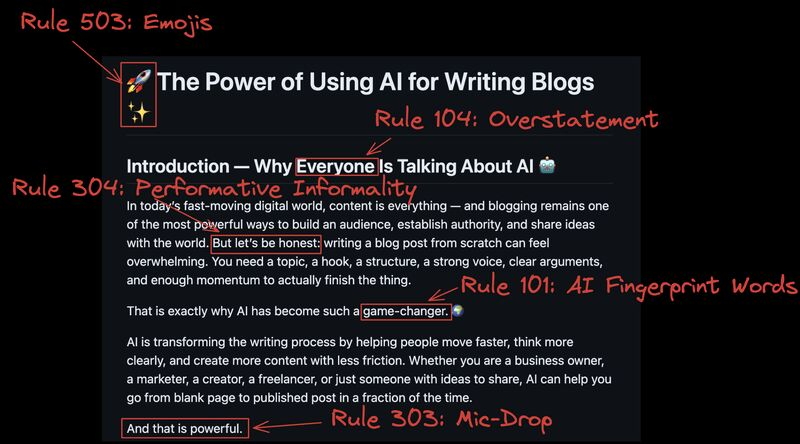

# Cringelinter Ralph
Ralph loop for de-cringing markdown documents written by AI. 

## Dependencies
- Claude clode
- cringelinter skill found at https://github.com/jbdamask/john-claude-skills.

## Configuration
- Copy prompt.txt and ralph.sh files into a folder containing the markdown document you want to decringe
- chmod +x ralph.sh (make the file executable)

## Use
./ralph.sh <filename> [number of iterations]

## Output
Sequentially-versioned documents.
cringelog.txt showing what was done in each iteration

