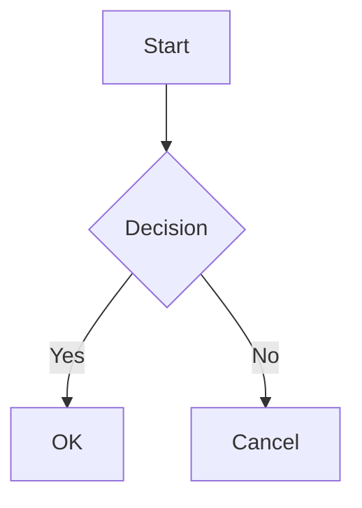
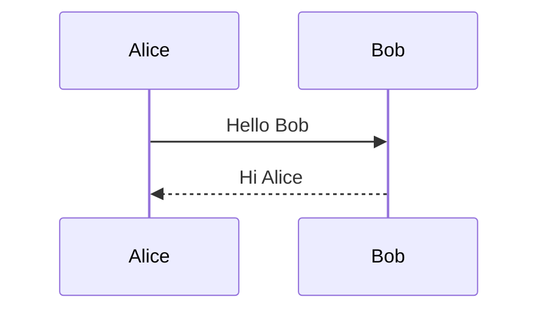
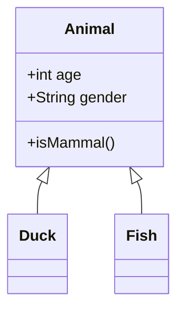

# Mermaid Diagram Renderer

A single-page web application for rendering Mermaid diagrams with an interactive viewer.

## Features

### Input
- **Paste Mermaid syntax** directly into the textarea
- **File upload** via drag-and-drop or file picker (supports `.mmd`, `.mermaid`, `.txt`, `.md`)
- **Auto-render** with 500ms debounce as you type
- **Example diagram** button to quickly see the renderer in action

### Output Viewer
- **Light-themed canvas** for clear diagram visibility
- **Pan**: Click and drag to navigate around the diagram
- **Zoom controls**:
  - `-` / `+` buttons for manual zoom (10% - 500% range)
  - Mouse wheel zoom (zooms toward cursor position)
  - `Fit` button to auto-fit diagram to panel size
- **Download SVG** export

### UI
- **Dark terminal-aesthetic theme** (webapp-dark)
- **Resizable panels** - drag the handle between panels to adjust sizes
- **Collapsible panels** - click `«` or `»` to collapse/expand panels
- **Responsive layout** - switches to vertical stacking on narrow screens (< 900px)
- **Touch support** for mobile devices

## Usage

Open `mermaid-renderer.html` in any modern web browser:

```bash
open mermaid-renderer.html
```

Or double-click the file to open it in your default browser.

## Mermaid Syntax Examples

### Flowchart


### Sequence Diagram


### Class Diagram


## Dependencies

- [Mermaid.js](https://mermaid.js.org/) v10 (loaded via CDN)
- [JetBrains Mono](https://fonts.google.com/specimen/JetBrains+Mono) font (loaded via Google Fonts)

## Browser Support

Works in all modern browsers (Chrome, Firefox, Safari, Edge).

## Theme

Uses a custom dark theme based on webapp-dark:
- Background: `#0a0e1a` (deep dark blue)
- Text: `#a3b8cc` (light blue-gray)
- Accent: `#34d399` (bright green)
- Surface: `#1e293b` (cards/panels)
- Viewer: `#f8fafc` (light slate)
