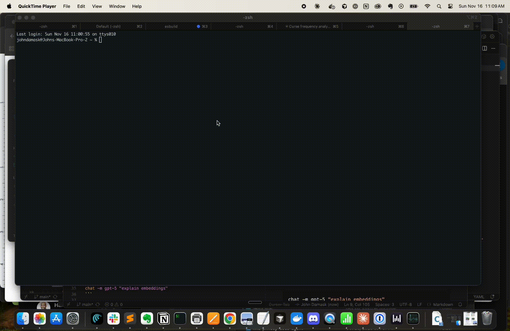

# chat — a tiny streaming CLI for OpenAI models

`chat` is a lightweight command-line tool that streams responses from OpenAI’s Responses API.  
It supports natural streaming output, piping files into prompts, and selecting between GPT-4.1 and GPT-5 class models.



## Features
- Natural, real-time streaming output  
- Accepts both arguments and stdin  
- Supports model selection (`gpt-4.1`, `gpt-4.1-mini`, `gpt-4.1-nano`,`gpt-5`, `gpt-5-mini`, `gpt-5-nano`)  
- Works with piping, redirection, and `tee`  
- Tiny, dependency-free shell wrapper + a small Python JSON filter  

## Installation
1. Save the script as `~/bin/chat` (or anywhere on your `$PATH`).  
2. Make it executable:
   ```sh
   chmod +x ~/bin/chat
   ```
3. Optional alias:
   ```sh
   echo 'alias chat="$HOME/bin/chat"' >> ~/.zshrc
   ```

Make sure `OPENAI_API_KEY` is set in your environment.

## Usage

### Basic prompt
```sh
chat "how do I create a tmux session?"
```

### Choose a model
```sh
chat -m gpt-5 "explain embeddings"
```

### Pipe a file into the prompt
```sh
cat notes.txt | chat "summarize this"
```

### Stream to a file
```sh
 chat "Create some synthentic data for me in jsonl format. The structure is {item : {input, ideal}}. The topic is an IT helpdesk ticket categorizer. You should respond ONLY with the records, no additional text, comments, or formatting" > it-ground-truth.jsonl
 ```

### View + save
```sh
chat "write a winter story" | tee winter.txt
```


## Notes
- stdin and arguments are combined automatically.  
- Output is pure text.
- The tool streams only `response.output_text.delta` events for clean, uninterrupted output.  

