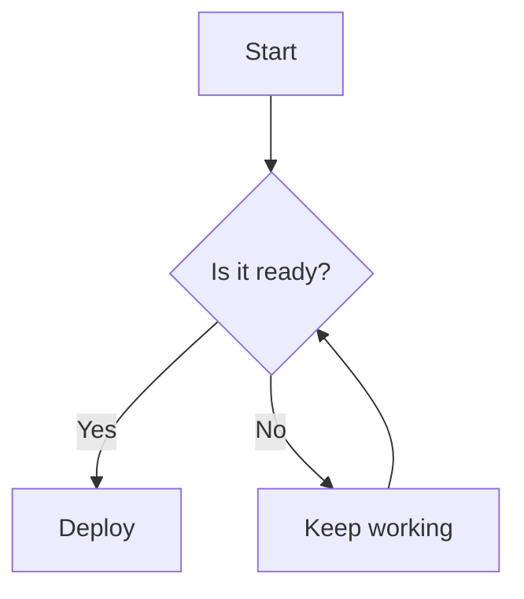

# Pretty Markdown

A simple, elegant single-page web application for viewing and editing Markdown files directly in your browser.

## What is Pretty Markdown?

Pretty Markdown is a lightweight Markdown viewer and editor that provides a clean, intuitive interface for working with Markdown documents. Whether you need to quickly preview a README file, edit documentation, or create new Markdown content, this tool offers everything you need in a streamlined web interface.

## Key Features

### File Management
- **Drag & Drop Support**: Simply drag Markdown files directly into the application
- **File Upload**: Click to browse and select files from your computer
- **Collapsible Sidebar**: Minimize the file selector to maximize your workspace

### Dual-Panel Interface
- **Preview Tab**: Real-time rendering of your Markdown content with proper styling
- **Edit Tab**: Full-featured text editor for modifying your documents
- **Live Updates**: Changes in the editor instantly reflect in the preview

### Export Functionality
- **Save Changes**: Download your edited files directly to your computer
- **Preserve Formatting**: Maintains original file names and Markdown formatting

## Use Cases

- **Documentation Review**: Quickly preview README files, documentation, and technical guides
- **Content Editing**: Make quick edits to existing Markdown files without switching applications  
- **Learning Markdown**: Practice Markdown syntax with instant visual feedback
- **Collaborative Work**: Share and review Markdown content in a user-friendly format
- **Blog Post Creation**: Draft and preview blog posts written in Markdown
- **Project Documentation**: View and edit project wikis, changelogs, and documentation

## Supported Content

Pretty Markdown supports standard Markdown syntax including:
- Headers (H1-H6)
- Text formatting (bold, italic, strikethrough)
- Code blocks and inline code
- Lists (ordered and unordered)
- Links and images
- Blockquotes
- Tables
- Horizontal rules
- **Mermaid Diagrams**: Interactive flowcharts, sequence diagrams, and more

## Getting Started

1. Open `pretty-markdown.html` in any modern web browser
2. Upload a Markdown file using the file selector or drag it into the application
3. View the rendered content in the Preview tab
4. Switch to the Edit tab to make changes
5. Click the save button to download your modified file

### Using Mermaid Diagrams

To create interactive diagrams, use Mermaid code blocks in your Markdown:

````markdown

````

Supported diagram types include flowcharts, sequence diagrams, class diagrams, state diagrams, and more.

## Technical Details

- **No Installation Required**: Runs entirely in the browser
- **Client-Side Processing**: All file processing happens locally for privacy
- **Modern Browser Support**: Compatible with Chrome, Firefox, Safari, and Edge
- **Responsive Design**: Works on desktop and tablet devices
- **Lightweight**: Single HTML file with embedded CSS and JavaScript

Pretty Markdown is perfect for developers, writers, and anyone who works with Markdown files and needs a quick, reliable way to view and edit them without installing additional software.